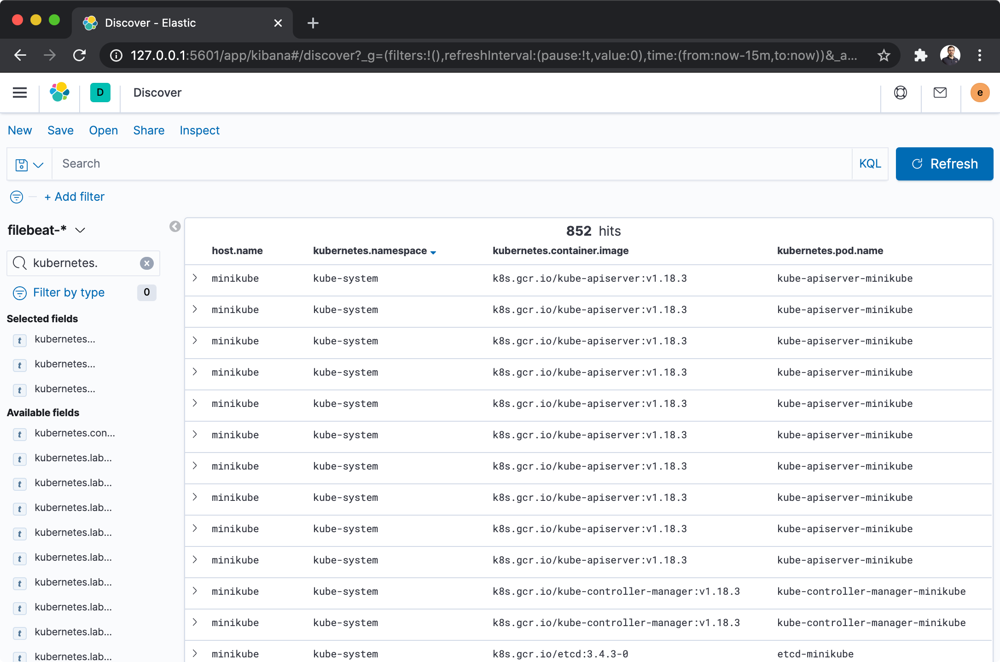

# ELK Setup

## Deploy ELK
```bash
❯ plz run //components/elk:deploy
```
* Creates `elastic-system` namespace
* Deploys the Elastic Operator
* Deploys an Elasticsearch cluster
* Deploys a Kibana instance
* Deploys Filebeats, configured to retrieve and ship container logs to Elasticsearch

Verify pods are healthy:
```bash
❯ kubectl -n elastic-system get pods
NAME                         READY   STATUS    RESTARTS   AGE
elastic-operator-0           1/1     Running   1          106m
elasticsearch-es-default-0   0/1     Running   1          105m
filebeat-sjt84               1/1     Running   1          105m
kibana-kb-84645887d8-9fcsf   0/1     Running   1          105m
```

## Access Elasticsearch and Kibana
```bash
❯ plz run //components/elk:ui
```
* Forwards the Kibana UI to http://127.0.0.1:5601



* Forwards the Elasticsearch Service:
    * From inside the Kubernetes cluster: `curl -u '${ELASTIC_USER}:${ELASTIC_PASSWORD}' -k 'http://elasticsearch-es-http:9200'`
    * From your local workstation: `curl -u '${ELASTIC_USER}:${ELASTIC_PASSWORD}' -k 'http://localhost:9200'`

```bash
❯ curl -u 'elastic:<redacted>' -k 'http://localhost:9200'
{
  "name" : "elasticsearch-es-default-0",
  "cluster_name" : "elasticsearch",
  "cluster_uuid" : "WLFbN05xRKqYYA0H6RN_mg",
  "version" : {
    "number" : "7.8.0",
    "build_flavor" : "default",
    "build_type" : "docker",
    "build_hash" : "757314695644ea9a1dc2fecd26d1a43856725e65",
    "build_date" : "2020-06-14T19:35:50.234439Z",
    "build_snapshot" : false,
    "lucene_version" : "8.5.1",
    "minimum_wire_compatibility_version" : "6.8.0",
    "minimum_index_compatibility_version" : "6.0.0-beta1"
  },
  "tagline" : "You Know, for Search"
}
```

## References
* [Getting started with Elastic Cloud on Kubernetes: Deployment](https://www.elastic.co/blog/getting-started-with-elastic-cloud-on-kubernetes-deployment)
* [Deploy ECK in your Kubernetes cluster](https://www.elastic.co/guide/en/cloud-on-k8s/current/k8s-deploy-eck.html)
* [Run Filebeat on Kubernetes](https://www.elastic.co/guide/en/beats/filebeat/master/running-on-kubernetes.html)
