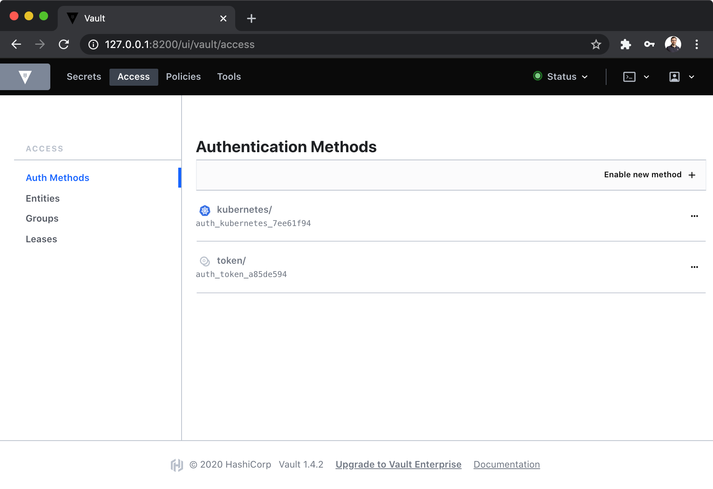

# Vault Setup


## Deploy Vault
```bash
❯ plz run //components/vault:deploy
```
* Creates `vault` namespace
* Fetches and deploys the Vault Helm chart in the `vault` namespace
* Initializes (unseal) Vault
* Enables Kubernetes backend (will print the root token to screen)
* Setup the sidecar Agent, by creating a role/policy for the sidecar which allows it to read any secret in the kv-v2 `secret/` backend

Verify pods are healthy:
```bash
❯ kubectl -n vault get po
NAME                                         READY   STATUS    RESTARTS   AGE
vault-helm-0                                 1/1     Running   0          2m2s
vault-helm-agent-injector-5d7c4965d7-7dnp9   1/1     Running   0          2m3s
```


## Access the Vault UI
```bash
❯ plz run //components/vault:ui
```
* Forwards Vault UI to http://127.0.0.1:8200




## Inject secrets into Pods
For this setup, the Vault Agent has been given access to read any secret in the kv-v2 `secret/` backend,
so any secret stored in that backend will be able to get picked by the Agent.

In addition, the Vault Agent injector only modifies a deployment if it contains a specific set of annotations. An existing deployment may have its definition patched to include the necessary annotations.
A sample is provided at `//k8s-lab/components/vault/k8s/sample-deployment.yaml`, where the deployment
requires the `secret/data/database/config` secret.

To run the example (which will create a secret at `secret/database/config` before deploying the pod):
```bash
❯ plz run //components/vault:sample-deployment
```

To check the pod is healthy:
```bash
❯ kubectl logs -f vault-agent-injector-demo-78d49f7c6-lx88q orgchart
Listening on port 8000...
```


## References
* [Vault Installation to Minikube via Helm](https://learn.hashicorp.com/vault/kubernetes/minikube)
* [Injecting Secrets into Kubernetes Pods via Vault Sidecar](https://learn.hashicorp.com/vault/kubernetes/sidecar)
* [Kubernetes authentication method](https://www.vaultproject.io/docs/auth/kubernetes.html)
